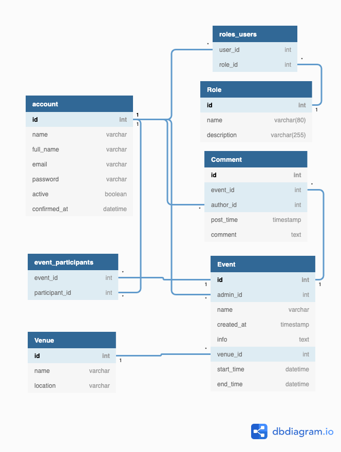

# Tapahtumakalenteri

#### Harjoitustyö - Tietokantasovellus - Alkukesä 2020

Sovelluksen avulla rekisteröityneet käyttäjät voivat selata, lisätä ja osallistua tapahtumiin sekä käydä keskustelua tapahtuman sivulla.

Käyttötapauksista löytyy tarkemmat kuvaukset [täältä.](documentation/kayttotapaukset.md)

## Sovellus Herokussa
[Avaa tästä](https://tsoha-pontushed.herokuapp.com) Kirjaudu sisään tunnuksella 'admin', salasana 'admin', tai rekisteröidy uutena käyttäjänä. Kaikilla käyttäjillä on tällä hetkellä samat (admin)oikeudet.

## Dokumentaatio

#### Tietokantakaavio:

#### Muu dokumentaatio

[Työaikakirjanpito](documentation/tyoaikakirjanpito.md)

[Kehityspäiväkirja](documentation/kehityspaivakirja.md)
